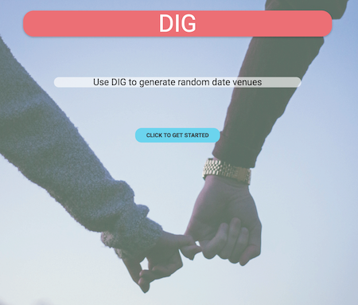

# Project Title

DIG (Dating Idea Generator) is an application that generates a random date idea when you need a quick spontaneous date venue. 
https://deyanp19.github.io/datingApp/

;
## Getting Started

To get a copy of the project

```
git clone "https://github.com/deyanp19/datingApp.git"
```

You will need an api key for Google Maps API, Foursquare client id and client key.

### Prerequisites

Google Maps API key
Link ref to Materialize.css
Foursquare API client key and client id

## Deployment

This project was deployed through Github Pages

## Built With

* Materialize css
* Foursquare API
* HTML/CSS
* JavaScript and jQuery
* Google Maps API


## Authors

Fidel Dubon
Ricky Rosales
Deyan Petrov
Alex Kim
